# Code Audit 项目 OpenCode 格式转换方案

## 背景分析

当前项目由两个单体文件定义完整审计工作流:

- [SKILL.md](SKILL.md) (~365行): 入口 + 执行控制器(Step 1-6) + 规则 + 模块参考
- [agent.md](agent.md) (~1522行): 详细方法论 + 状态机 + Multi-Agent 定义 + 报告格式

需要按 opencode 的 agent/skill 体系重构为可组合、可独立调用的模块。

## 转换架构

```mermaid
graph TD
    CodeAudit["code-audit (Primary Agent)<br/>调度器/编排器"]
    
    subgraph subagents [Subagents]
        Recon["audit-recon<br/>Phase 1 侦察"]
        D1["audit-d1-injection<br/>D1 注入 (sink-driven)"]
        D2D3D9["audit-d2d3d9-control<br/>D2+D3+D9 (control-driven)"]
        D4["audit-d4-rce<br/>D4 RCE/反序列化 (sink-driven)"]
        D5D6["audit-d5d6-file-ssrf<br/>D5+D6 文件/SSRF (sink-driven)"]
        D7D8D10["audit-d7d8d10-config<br/>D7+D8+D10 (config-driven)"]
        Eval["audit-evaluation<br/>轮次评估"]
        Report["audit-report<br/>报告生成"]
        QuickDiff["audit-quick-diff<br/>增量审计"]
    end
    
    subgraph skills [Skills]
        S1["anti-hallucination"]
        S2["anti-confirmation-bias"]
        S3["taint-analysis"]
        S4["attack-chain"]
        S5["severity-rating"]
        S6["coverage-matrix"]
        S7["agent-contract"]
        S8["report-template"]
        S9["tech-stack-router"]
        S10["audit-phase-methodology"]
    end
    
    CodeAudit --> Recon
    CodeAudit --> D1
    CodeAudit --> D2D3D9
    CodeAudit --> D4
    CodeAudit --> D5D6
    CodeAudit --> D7D8D10
    CodeAudit --> Eval
    CodeAudit --> Report
    CodeAudit --> QuickDiff
    
    D1 -.-> S1
    D1 -.-> S3
    D2D3D9 -.-> S1
    D4 -.-> S1
    D5D6 -.-> S1
    D7D8D10 -.-> S1
    Eval -.-> S6
    Report -.-> S5
    Report -.-> S8
    Report -.-> S4
    CodeAudit -.-> S7
    CodeAudit -.-> S9
    CodeAudit -.-> S10
    Recon -.-> S9
```




## 目录结构

```
transform/
├── opencode.json                          # OpenCode 配置 (模型/权限/工具)
├── AGENTS.md                              # 项目级说明 + 模块参考表
├── .opencode/
│   ├── agents/
│   │   ├── code-audit.md                  # Primary: 调度器/编排器
│   │   ├── audit-recon.md                 # Subagent: Phase 1 侦察
│   │   ├── audit-d1-injection.md          # Subagent: D1 注入
│   │   ├── audit-d2d3d9-control.md        # Subagent: D2+D3+D9
│   │   ├── audit-d4-rce.md               # Subagent: D4 RCE/反序列化
│   │   ├── audit-d5d6-file-ssrf.md        # Subagent: D5+D6 文件/SSRF
│   │   ├── audit-d7d8d10-config.md        # Subagent: D7+D8+D10
│   │   ├── audit-evaluation.md            # Subagent: 轮次评估
│   │   ├── audit-report.md                # Subagent: 报告生成
│   │   └── audit-quick-diff.md            # Subagent: Quick-Diff 增量审计
│   └── skills/
│       ├── anti-hallucination/SKILL.md    # 防幻觉规则
│       ├── anti-confirmation-bias/SKILL.md # 防确认偏误规则
│       ├── taint-analysis/SKILL.md        # 污点分析方法论
│       ├── attack-chain/SKILL.md          # 攻击链构建方法
│       ├── severity-rating/SKILL.md       # 严重度评级框架
│       ├── coverage-matrix/SKILL.md       # 覆盖率矩阵+两层检查清单
│       ├── agent-contract/SKILL.md        # Agent 合约模板(R1/R2+)
│       ├── report-template/SKILL.md       # 报告输出模板
│       ├── tech-stack-router/SKILL.md     # 技术栈→专项路由表
│       └── audit-phase-methodology/SKILL.md # 五阶段审计模型
```

## 内容分配映射 (确保不删减)

### Primary Agent: `code-audit.md`

来源内容 (原文件 -> 映射):

- SKILL.md "When to Use" + "Trigger" -> 触发条件
- SKILL.md "Execution Controller" Step 1-6 -> 核心控制流
- agent.md "Scan Modes" 表格 + Quick-Diff 说明 -> 模式判定逻辑
- agent.md "执行状态机" 完整状态图 (PHASE_1_RECON / ROUND_N_RUNNING / ROUND_N_EVALUATION / NEXT_ROUND / REPORT) -> 调度状态机
- agent.md "Agent 切分约束" + "攻击面驱动 Agent 方向" + "Agent 组合模板" + "Agent 数量" -> Agent 分配策略
- agent.md "Root Coordinator" + "智能体原则" -> 协调者逻辑
- agent.md "主线程截断检测与恢复" -> 截断恢复流程
- agent.md "Multi-Round Audit Strategy" 三轮模型 -> 多轮策略
- agent.md "增量效率优化" -> Token 节约策略
- agent.md "审计工作原则" (反隧道视野/Agent同步纪律) -> 工作原则
- agent.md "Permissions / Execution Policy" -> 权限策略
- SKILL.md "反降级规则" -> 反降级约束

### Subagent 内容来源

- **audit-recon.md**: agent.md Phase 1 完整内容 (Step 1.0 构建文件枚举 + Step 1.1-1.8 信息收集 + 模块覆盖验证矩阵 + 功能模块发现 + 快速排除 + 五层攻击面推导)
- **audit-d1-injection.md**: agent.md Phase 2A 注入相关优先级 + 单文件审计4步 + 数据转换管道追踪(条款#9)
- **audit-d2d3d9-control.md**: agent.md Phase 2.5-2.6 完整方法论 + 反向端点审计 + 认证旁路路径枚举 + IDOR/越权检测流程 + 功能域攻击面表
- **audit-d4-rce.md**: D4 反序列化/RCE 审计方向 + 快速排除模式参考
- **audit-d5d6-file-ssrf.md**: D5+D6 文件操作/SSRF 审计方向
- **audit-d7d8d10-config.md**: D7+D8+D10 配置/加密/供应链 + Phase 2.7 加密深度
- **audit-evaluation.md**: 执行状态机中 ROUND_N_EVALUATION 完整内容 (覆盖缺口评估 + 三问法则 + Sink扇出检查 + 跨轮传递结构 + 自适应轮次决策)
- **audit-report.md**: agent.md REPORT 状态完整内容 (冲突解决 + 严重度校准 + 攻击链自动构建) + Output Format 完整节 (报告总体架构 + 漏洞模板 + 污点分析报告模板 + 报告质量标准)
- **audit-quick-diff.md**: agent.md Quick-Diff 模式完整定义

### Skill 内容来源

- **anti-hallucination**: agent.md "防幻觉规则" 完整定义 + SKILL.md "Anti-Hallucination Rules"
- **anti-confirmation-bias**: SKILL.md "Anti-Confirmation-Bias Rules" 完整定义
- **taint-analysis**: agent.md "污点分析触发" + 引用 `references/core/taint_analysis.md`
- **attack-chain**: agent.md "攻击链思维" 完整节 (链式推导方法 + 常见链式模式表)
- **severity-rating**: agent.md "Severity Rating" 完整节 (等级定义 + 三维评估 + 决策树 + 编号体系)
- **coverage-matrix**: agent.md "Two-Layer Checklist Architecture" + SKILL.md "Two-Layer Checklist"
- **agent-contract**: agent.md "Agent 合约" + "Agent 输出模板" + "自动注入模板 R1/R2+" + "Token 预算管理" + "输出预算规则"
- **report-template**: agent.md "Output Format" 节 (报告架构 + 漏洞模板 + 质量标准)
- **tech-stack-router**: agent.md "技术栈→专项路由表" + "技术栈识别" + "功能模块发现与攻击面映射" + "边界交互矩阵"
- **audit-phase-methodology**: agent.md "五阶段审计模型与精力分配" + Phase 2A/2B/3 完整方法论 + "激进扫描原则"

### AGENTS.md

- SKILL.md "Module Reference" (Core Modules / Language Modules / Security Domain Modules) 完整表格
- SKILL.md "Tool Priority Strategy"
- SKILL.md "Version" 信息
- agent.md "Core Modules" 完整表格
- agent.md "Language & Framework Modules" 完整表格
- agent.md "安全专项模块" 列表
- agent.md "工具使用原则" + "核心工具" + "代码修复工具" + "错误恢复指导"
- Docker 部署验证说明

### opencode.json

- file_patterns / exclude_patterns 从 SKILL.md frontmatter 转换
- 模型配置
- Agent 注册和工具权限
- 技能权限

## 格式规范

所有 Agent markdown 文件遵循 opencode 格式:

```yaml
---
description: "..."
mode: primary|subagent
# model: anthropic/claude-sonnet-4-5  # 或按角色选型
temperature: 0.x
tools:
  write: true|false
  edit: true|false
  bash: true|false
  skill: true|false
permission:
  task:
    "audit-*": allow
---
```

所有 Skill markdown 文件遵循:

```yaml
---
name: skill-name
description: "..."
---
```

## 注意事项

- `references/` 目录保持不变，agents 和 skills 通过 Read 工具引用
- 所有原始定义通过上述映射关系完整保留，只拆分不删减
- Primary agent 通过 task 权限控制只能调用 `audit-*` 前缀的 subagent
- 每个 subagent 的 prompt 内嵌其职责范围内的完整规则
- Skill 通过 opencode 的 `skill` 工具按需加载

